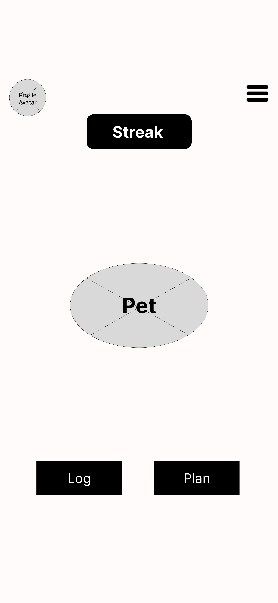
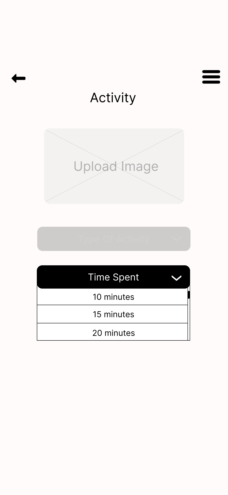

# UX Design Documentation

This document presents the prototype, app map, and the complete set of wireframes for the nourishpet project.  

## Interactive Prototype

Our initial prototype showcases an example of the minimum viable product of nourishpet with interactive wireframe diagrams. It is viewable [here](https://www.figma.com/proto/ZUZtsZU2b6FteRoFpRN528/Random_NourishPet?node-id=0-1&t=c58JPs3iFqfZW9Px-1)!

You can access the prototype source files at [Google Drive](https://drive.google.com/drive/folders/1bYv3y7M9t8yZWd8Hfi3gr0gRvOHKrtrQ?usp=sharing).

## App Map
The diagram below depicts the general flow of our minimum viable product as we have imagined it at the time of writing. It is subject to change.

---
## Wireframes
## 1. Authentication & Admin

| Login | Sign-In | Forgot Password |
|:--:|:--:|:--:|
|  |  |  |
| *Login screen for existing users.* | *Registration screen for new users.* | *Password reset flow.* |

| Update Password | Update Username | Update Profile |
|:--:|:--:|:--:|
|  |  |  |
| *Change account password.* | *Edit username credentials.* | *Modify personal profile details.* |

---

## 2. Main Dashboard & Navigation

| Main | Main Dropdown | Streak Pop-Up |
|:--:|:--:|:--:|
|  |  |  |
| *Primary dashboard with main functionalities accessible.* | *Dropdown menu providing quick access to major app sections.* | *Motivational pop-up showing streak progress and sharing option.* |

---

## 3. Activities

| Activity | Activity Type | Activity Duration |
|:--:|:--:|:--:|
|  |  |  |
| *Main screen for logging activities.* | *Dropdown menu for activity type.* | *Dropdown menu for activity duration* |

---

## 4. Focus Mode

| Focus Mode | Enabled Focus Mode |
|:--:|:--:|
|  |  |
| *Focus Mode.* | *Focus mode enabled.* |

---

## 5. Meal Planning & Nutrition

| Generate Meal Plan | Plan Duration | Plan Goal |
|:--:|:--:|:--:|
|  |  |  |
| *Initial meal plan generation screen.* | *Meal plan duration dropdown options.* | *Meal plan goal options.* |

| Manage Meal Plan | Manage Meal Plan Goal| Manage Meal Plan Duration |
|:--:|:--:|:--:|
|  |  |  |
| *Manual plan adjustment.* | *Manual meal plan goal options.* | *Manual meal plan duration options* |

| Logging Calories | My Plan |
|:--:|:--:|
|  |  |
| *Interface for tracking daily meals.* | *Summary screen of plan and schedule.* |

---

## 6. Profile, Biometric & Social

| Profile | Biometric Data | Connect Socials |
|:--:|:--:|:--:|
|  |  |  |
| *User profile overview with personal details and preferences.* | *Display of recorded biometric information and stats.* | *Option to link external accounts or share progress on social platforms.* |

